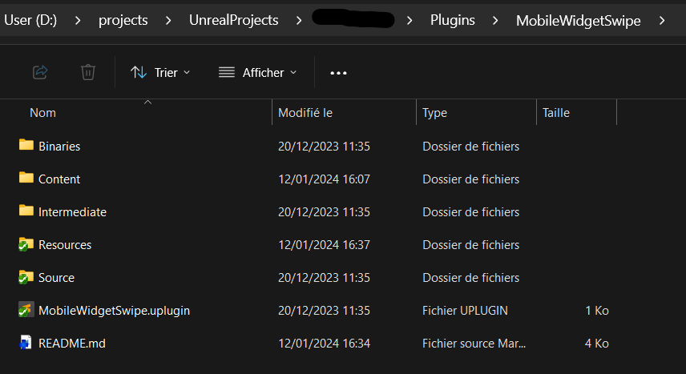

# Why
The goal with this really small library is to allow you to create swipe feature with a widget, like in your photo app. 

# Requirements
Manual installation require an Unreal C++ project and Unreal 5.3.
# Setup
At your root project folder, go to `Plugins` directory (create it if not present). 
Create a folder named `MobileWidgetSwipe` and copy all the files of this project in.

Open the project (restart if opened during the process) and go to `Edit/Plugins` and activate the new plugin MobileWidgetSwipe.

# Usage Exemples

# Disclaimer
All kind of variables aren't implemented yet, you can add the missing type if you want and send me a pull request, just test the code on your side please.