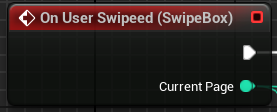

# Why
The goal with this really small library is to allow you to create swipe feature with a widget, like in your photo app. I create it because it's a common feature on Mobile devices.

Also, this component can take full page slot:

# Requirements
Manual installation require an Unreal C++ project and Unreal 5.3.
# Setup
At your root project folder, go to `Plugins` directory (create it if not present). 
Create a folder named `MobileWidgetSwipe` and copy all the files of this project in.

Open the project (restart if opened during the process) and go to `Edit/Plugins` and activate the new plugin MobileWidgetSwipe.

# Customization
## Orientation
You can use this component Horizontally ou Vertically.
 
## Swipe action
### Blend Func
You can change the Blend function of the swipe animation.

As example, see these three preview with 1.0 speed
#### Linear speed 1.0

#### Sinusoidal in speed 1.0

#### Sinusoidal out speed 1.0

# Blueprint
## Children
It's like any other unreal panel, place the SwipeBox in your hiearchy, and put your elements as children.

## Event
You can register your custom function with the Swipe Event.

## Change page
You can modify the page with Blueprint.

## Other
You will find many other properties to set in the properties panel and in the event graph.

# Usage Exemples
## Tab menu
If you have a tab menu, it's painful for the user to click to the most upper part of the screen. You can ease the process with swipe feature.

# Disclaimer
All features in this component aren't fully implemented. The ScrollBox was use as the base of the development so there is some features of ScrollBox that appears in Properties panel but not ready yet.